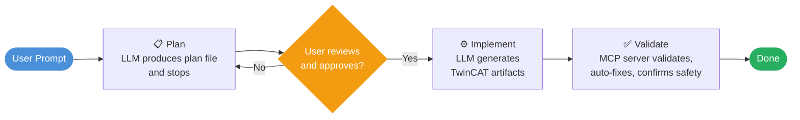
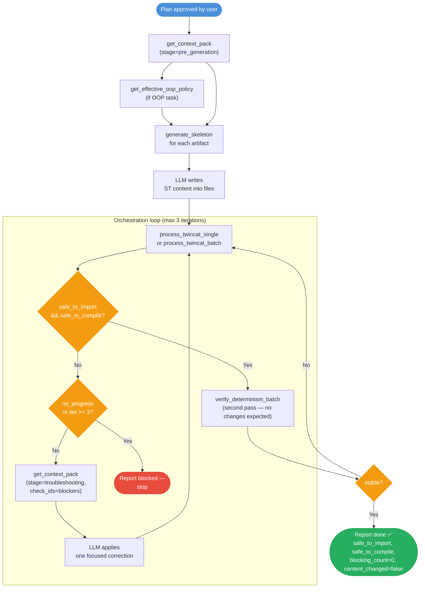

# TwinCAT Validator MCP Server

[](https://www.python.org/downloads/)
[](https://opensource.org/licenses/MIT)
[](https://modelcontextprotocol.io)
[](https://github.com/psf/black)

An MCP server that validates, auto-fixes, and scaffolds TwinCAT 3 XML files (`.TcPOU`, `.TcIO`, `.TcDUT`, `.TcGVL`). Connect it to any LLM client to give your AI assistant reliable, deterministic TwinCAT code quality tooling — structural checks, 21 IEC 61131-3 OOP checks, auto-fix pipelines, and canonical skeleton generation.

## Supported File Types

| Extension | Description |
|-----------|-------------|
| `.TcPOU` | Program Organization Units — Function Blocks, Programs, Functions |
| `.TcIO`  | I/O configurations — Interfaces |
| `.TcDUT` | Data Unit Types — Structures, Enums, Type Aliases |
| `.TcGVL` | Global Variable Lists |

## Installation

```bash
pip install twincat-validator-mcp
```

### From Source

```bash
git clone https://github.com/agenticcontrolio/twincat-validator-mcp.git
cd twincat-validator-mcp
pip install -e .
```

## Claude Desktop Extension

The easiest way to use this server with Claude Desktop is via the one-click `.dxt` extension:

1. `pip install twincat-validator-mcp`
2. Download the `.dxt` file from the [latest release](https://github.com/agenticcontrolio/twincat-validator-mcp)
3. Open Claude Desktop → **Settings** → **Extensions** → **Install Extension**

See [dxt/README.md](dxt/README.md) for full instructions and troubleshooting.

## Connecting to an LLM Client

For other clients (Cursor, VS Code, Windsurf, Cline), the server uses **stdio** transport. Add the following to your client's MCP config file:

#### Cursor — `.cursor/mcp.json`

```json
{
  "mcpServers": {
    "twincat-validator": {
      "command": "twincat-validator-mcp",
      "args": []
    }
  }
}
```

#### VS Code (Copilot / Continue) — `.vscode/mcp.json`

```json
{
  "servers": {
    "twincat-validator": {
      "type": "stdio",
      "command": "twincat-validator-mcp",
      "args": []
    }
  }
}
```

#### Windsurf — `~/.codeium/windsurf/mcp_config.json`

```json
{
  "mcpServers": {
    "twincat-validator": {
      "command": "twincat-validator-mcp",
      "args": []
    }
  }
}
```

#### Cline (VS Code Extension)

```json
{
  "mcpServers": {
    "twincat-validator": {
      "command": "twincat-validator-mcp",
      "args": [],
      "disabled": false
    }
  }
}
```

<details>
<summary>From-source config (all clients)</summary>

Replace `"command": "twincat-validator-mcp"` with:

```json
"command": "python",
"args": ["-m", "twincat_validator"],
"cwd": "/path/to/twincat-validator-mcp"
```

</details>

## MCP Tools

### Validation

| Tool | Description |
|------|-------------|
| `validate_file` | Full validation of a single file — returns all issues with severity, location, code snippet, and explanation |
| `validate_batch` | Validate multiple files matching glob patterns (e.g. `["**/*.TcPOU"]`) |
| `validate_for_import` | Quick critical-only check to confirm a file is safe to import into TwinCAT |
| `check_specific` | Run a named subset of validation checks on a file |
| `get_validation_summary` | Return a 0–100 health score with issue counts by severity |
| `suggest_fixes` | Generate prioritized fix recommendations from a validation result |

### Auto-fix

| Tool | Description |
|------|-------------|
| `autofix_file` | Apply all safe auto-fixes to a single file in deterministic order |
| `autofix_batch` | Apply auto-fixes to multiple files matching glob patterns |
| `generate_skeleton` | Generate a canonical, deterministic XML skeleton for a given file type and subtype |
| `extract_methods_to_xml` | Promote inline `METHOD` blocks from the main ST declaration into proper `<Method>` XML elements |

### Orchestration

| Tool | Description |
|------|-------------|
| `process_twincat_single` | Full enforced pipeline for one file: validate → autofix → validate → suggest fixes if still unsafe |
| `process_twincat_batch` | Full enforced pipeline across multiple files with summary or full response modes |
| `verify_determinism_batch` | Run the strict pipeline twice and report per-file idempotence stability |
| `get_effective_oop_policy` | Resolve the active OOP validation policy for a file or directory (walks ancestor dirs for `.twincat-validator.json`) |
| `lint_oop_policy` | Validate the nearest `.twincat-validator.json` config file — checks key names, types, and value ranges |
| `get_context_pack` | Return curated knowledge-base entries and OOP policy scoped to a workflow stage (`pre_generation` or `troubleshooting`) |

## Validation Checks

### Structure & Format (critical — blocks import)

- XML structure validity
- GUID format (`{xxxxxxxx-xxxx-xxxx-xxxx-xxxxxxxxxxxx}`)
- GUID uniqueness across elements
- Property getter VAR blocks (missing `VAR`/`END_VAR`)
- LineIds count consistency
- File ending format

### Style (warning — advisory)

- Tab characters (TwinCAT requires spaces)
- 2-space indentation
- Element ordering
- Naming conventions (`FB_`, `PRG_`, `FUNC_`, `E_`, `ST_`, `I_`, `GVL_`)
- Excessive blank lines
- CDATA formatting

### OOP — IEC 61131-3 (21 checks)

Runs automatically when `EXTENDS` or `IMPLEMENTS` is detected. Skipped for procedural code.

| Category | Checks |
|----------|--------|
| Inheritance safety | Extends visibility, extends cycle detection, diamond inheritance warning |
| Override correctness | Override marker, override signature match, override super call |
| Interface compliance | Interface contract, inheritance property contract, interface segregation |
| FB lifecycle | `FB_init` signature, `FB_init` super call, `FB_exit` contract |
| Memory safety | Dynamic creation attribute, pointer/delete pairing |
| Design quality | `THIS^` pointer consistency, abstract contract, abstract instantiation, composition depth |
| Property/method | Property accessor pairing, method visibility consistency, method count |


## Auto-fix Capabilities

Fixes are applied in a deterministic, dependency-aware order:

1. **Tabs** → 2 spaces (runs before indentation)
2. **File ending** — fixes truncated `]]>` after `</TcPlcObject>`
3. **Property newlines** — normalizes declaration line breaks
4. **CDATA formatting** — corrects CDATA section structure
5. **Property VAR blocks** — inserts missing `VAR`/`END_VAR` in getters
6. **Excessive blank lines** — reduces to max 2 consecutive
7. **Indentation** — normalizes to 2-space multiples
8. **GUID case** — uppercases hex to canonical lowercase
9. **LineIds** — experimental generation (marked unsafe, opt-in only)

Running autofix twice on the same file produces byte-identical output (idempotency guaranteed).

## Intent-Aware OOP Enforcement

All tools accept an `intent_profile` parameter:

| Value | Behavior |
|-------|----------|
| `"auto"` (default) | Detects OOP patterns (`EXTENDS`/`IMPLEMENTS`) automatically; runs OOP checks only when found |
| `"procedural"` | Skips all 21 OOP checks regardless of file content |
| `"oop"` | Always runs OOP checks |

Batch tools scan all `.TcPOU` files to resolve `"auto"` once at the batch level.

## Health Score

Files are scored 0–100 based on issue counts:

| Deduction | Severity |
|-----------|----------|
| −25 pts | Critical / error |
| −5 pts | Warning |
| −1 pt | Info |

| Score | Rating |
|-------|--------|
| 90–100 | Excellent — production ready |
| 70–89 | Good — minor issues |
| 50–69 | Needs work |
| 0–49 | Critical issues present |

Target ≥ 90 for all production files.

## MCP Resources

| URI | Description |
|-----|-------------|
| `validation-rules://` | All 34 check definitions |
| `fix-capabilities://` | All 9 fix definitions with complexity and risk level |
| `naming-conventions://` | TwinCAT naming patterns by file type |
| `config://server-info` | Server metadata and capability summary |
| `knowledge-base://` | Full LLM-friendly knowledge base |
| `knowledge-base://checks/{check_id}` | Explanation, examples, and common mistakes for one check |
| `knowledge-base://fixes/{fix_id}` | Algorithm and examples for one fix |
| `generation-contract://` | Deterministic generation contracts for all file types |
| `generation-contract://types/{file_type}` | Contract for `TcPOU`, `TcDUT`, `TcGVL`, or `TcIO` |
| `oop-policy://defaults` | Default OOP policy values |
| `oop-policy://effective/{target_path}` | Resolved OOP policy for a path |

## MCP Prompts

8 reusable prompt templates for canonical LLM workflows — covering single-file generation, batch validation, OOP scaffolding, determinism verification, and troubleshooting flows. Accessible via your MCP client's prompt interface.

## Agent Guide

[AGENT.md](AGENT.md) is an example guide prompt that tells your LLM agent exactly how to use this server — which tools to call, in what order, how to route intent (procedural vs OOP), stop conditions, and the reporting contract. Copy it into your system prompt or agent instructions and customise it to match your workflow.

## Recommended Workflow

The pattern for any TwinCAT generation task — no code is written until the user has approved the plan.



After approval, the LLM follows this MCP tool sequence:



See [EXAMPLE_PROMPT.md](EXAMPLE_PROMPT.md) for a complete worked prompt using this pattern.

## Configuration

Config files live in `twincat_validator/config/` inside the installed package. To locate them:

```python
import twincat_validator, os
print(os.path.join(os.path.dirname(twincat_validator.__file__), "config"))
```

| File | Purpose |
|------|---------|
| `validation_rules.json` | Check definitions — severity, category, auto_fixable flag |
| `fix_capabilities.json` | Fix definitions — complexity, risk level, deterministic order |
| `naming_conventions.json` | Naming patterns by file type and subtype |
| `knowledge_base.json` | LLM-friendly explanations and examples for all checks and fixes |
| `generation_contract.json` | Canonical XML generation rules and forbidden patterns |

Restart the server after editing config files to reload.

## Development

```bash
pip install -e ".[dev]"

# Run tests
pytest tests/

# Format
black --line-length=100 .

# Lint
ruff check .

# Type check
mypy twincat_validator/server.py --ignore-missing-imports

# Full CI suite (py311 + py312, lint, type check)
tox
```

## License

MIT — see [LICENSE](LICENSE) for details.

## Authors

Agentic Control - Jaime Calvente Mieres: design, architecture, and domain expertise

Built with the assistance of [Claude](https://claude.ai) (Anthropic) and [Codex](https://openai.com/codex) (OpenAI).
